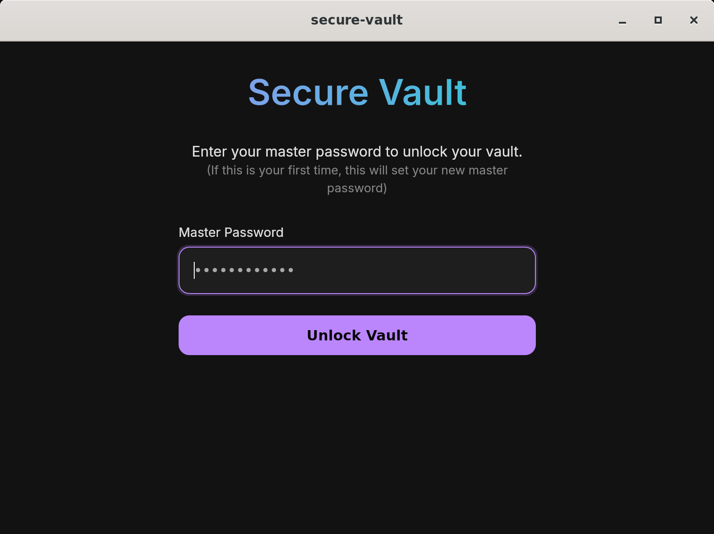

# Secure Vault 🔒

**Secure Vault** is a modern, secure, and offline desktop password generator application built with **Tauri v2**, **Rust**, and **Vanilla JavaScript (Vite)**. It combines the performance and security of Rust with the flexibility of web technologies.



## ✨ Features

- **Secure Vault**: Encrypts your data using **AES-256-GCM** and **Argon2id** key derivation.
- **Vault Management**: Add, edit, and organize passwords with folders.
- **Search**: Instantly find your credentials.
- **Secure Generation**: Leverages Rust's cryptographically secure random number generator.
- **Customizable**: Adjust password length, toggle characters, and generate passphrases.
- **Modern UI**: Sleek, dark-themed interface designed for focus and clarity.
- **Offline First**: Runs entirely on your machine.
- **Sync**: Cloud sync support (Mock implementation).

## 🛠️ Tech Stack

- **Core**: [Tauri v2](https://tauri.app/)
- **Backend**: Rust (Argon2, AES-GCM, Serde)
- **Frontend**: HTML5, CSS3, Vanilla JavaScript
- **Build Tool**: [Vite](https://vitejs.dev/)

## 🚀 Getting Started

### Prerequisites

- **Rust**: [Install Rust](https://www.rust-lang.org/tools/install).
- **Node.js**: [Install Node.js](https://nodejs.org/).
- **Linux Dependencies**:
  ```bash
  sudo apt-get update
  sudo apt-get install libwebkit2gtk-4.1-dev build-essential curl wget libssl-dev libgtk-3-dev libayatana-appindicator3-dev librsvg2-dev
  ```
- **Tauri CLI**: `npm install -g @tauri-apps/cli`

### Installation

1. **Clone the repository** (if using git):
   ```bash
   git clone https://github.com/yourusername/secure-vault.git
   cd secure-vault
   ```

2. **Install Frontend Dependencies**:
   ```bash
   cd src
   npm install
   cd ..
   ```

3. **Run in Development Mode**:
   ```bash
   cargo tauri dev
   ```
   This will start the Vite frontend server (port 1420) and the Tauri application window.

### Building for Production

To create a standalone executable:

```bash
cargo tauri build
```
The executable will be located in `src-tauri/target/release/bundle/`.

## 🔒 Security

This project has undergone a security audit and implements:
- **Strict Content Security Policy (CSP)**: Only allows local assets.
- **Secure API Access**: `withGlobalTauri` is disabled; APIs are imported via `@tauri-apps/api`.
- **Safe Cryptography**: Uses latest stable versions of `aes-gcm` and `argon2`.

## 🤝 Contributing

1. Fork the project
2. Create your feature branch (`git checkout -b feature/AmazingFeature`)
3. Commit your changes (`git commit -m 'Add some AmazingFeature'`)
4. Push to the branch (`git push origin feature/AmazingFeature`)
5. Open a Pull Request

## 📝 License

Distributed under the MIT License. See `LICENSE` for more information.
